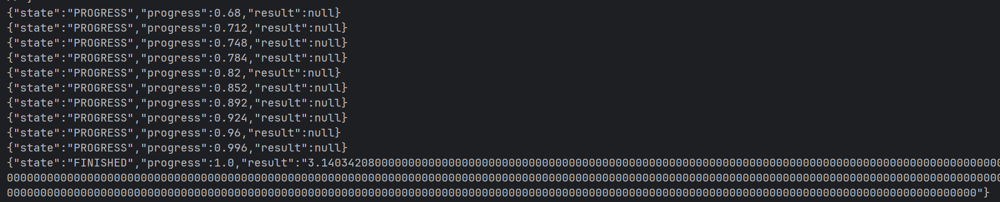

# PostTagger reimagined

Small **FastAPI + Celery** app that computes
n digits of π asynchronously using Redis as a broker
and Monte Carlo for the algorithm.

Currently, the project contains:
- FastAPI api with two endpoints:
  - `GET /calculate_pi?n=<int>` → `{"task_id": "<uuid>"}`
  - `GET /check_progress?task_id=<uuid>` → `{"state": "PROGRESS|FINISHED", "progress": 0..1, "result": null|string}`
- Celery worker and Redis broker running in Docker Compose.


## How it works (Monte Carlo)
We estimate π by sampling random points in the unit square and counting how many fall inside the quarter circle (x² + y² ≤ 1).  
The ratio ≈ π/4, so π ≈ 4 × (points_in_circle / total_points). The task runs in batches to report smooth progress (0..1). We format the final value to exactly *n* decimals.

## API Docs
[http://127.0.0.1:8000/docs](http://127.0.0.1:8000/docs)

 ## Run the application
```bash
git clone <repo-url>
cd <repo-folder>
#build and start
docker compose up --build 
#verify services
docker copose ps
#should show task registered
docker compose logs -f worker
```
## Start a job
curl "http://localhost:8000/calculate_pi?n=20"
## Poll
curl "http://localhost:8000/check_progress?task_id=<ID>"
## Stop
`docker compose down`
## Common issues 
- API 404 on /: expected (no root route). Use /docs, /calculate_pi, /check_progress.

- “unregistered task”: rebuild after clone: `docker compose up -d --build `

- Can’t reach Docker: start Docker Desktop.

## Experimentation 

You can run a calculation and poll its progress directly from a PowerShell
prompt.  Below is a simple example using PowerShell:

```
# Start a calculation of π to 12 decimal places
$resp = irm "http://localhost:8000/calculate_pi?n=12"
# irm = Invoke-RestMethod, which fetches the URL and auto-parses the JSON body

# Extract the task_id from the JSON response
$ID = $resp.task_id

# Poll the task until it finishes
while ($true) {
    iwr "http://localhost:8000/check_progress?task_id=$ID" | Select-Object -ExpandProperty Content
    # iwr = Invoke-WebRequest.  -ExpandProperty Content prints only the raw JSON body.
    Start-Sleep -Milliseconds 250   # short pause between polls
}
```

### Why you might see lots of zeros

The service always returns exactly **n decimal places**, so it pads the number with zeros if the estimate ends sooner.
Because our Monte Carlo result is a fraction from counting random points, sometimes that fraction ends neatly instead of going on forever.
When that happens the formatted output just keeps filling the rest of the requested decimal places with zeros.

